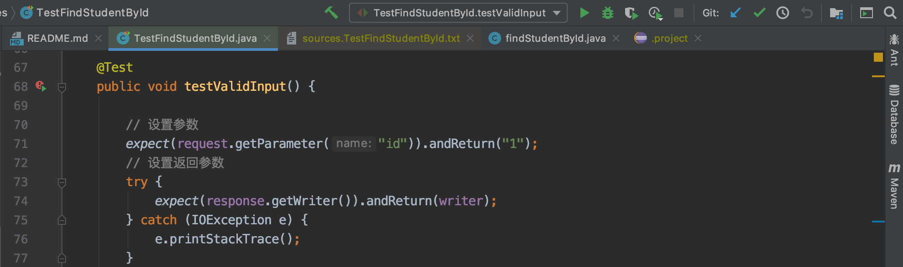
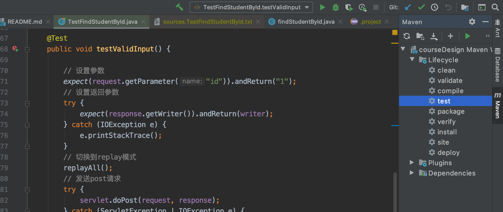
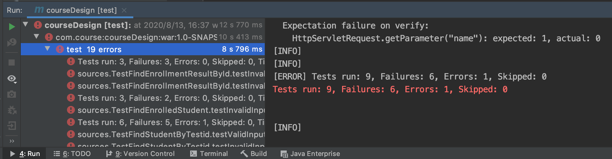
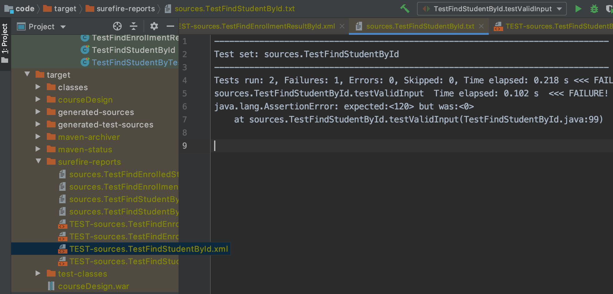
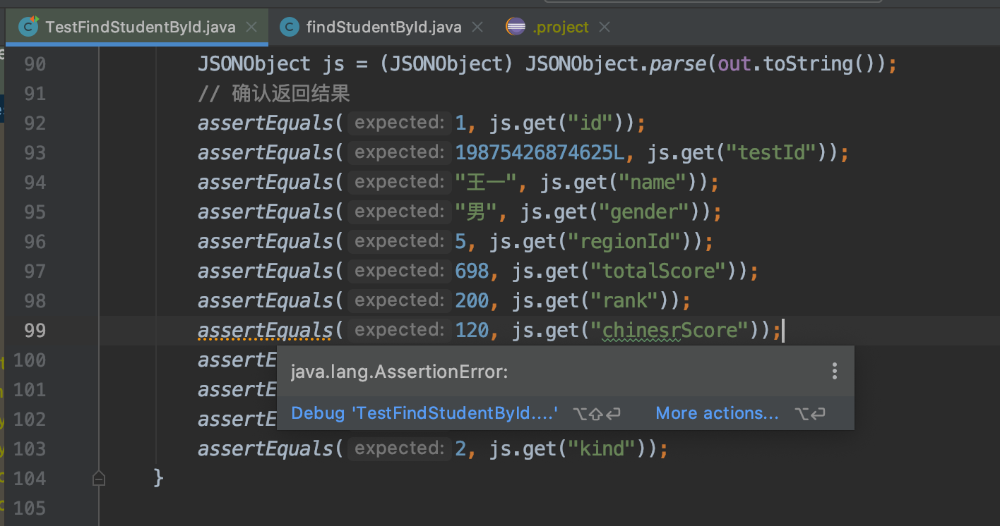
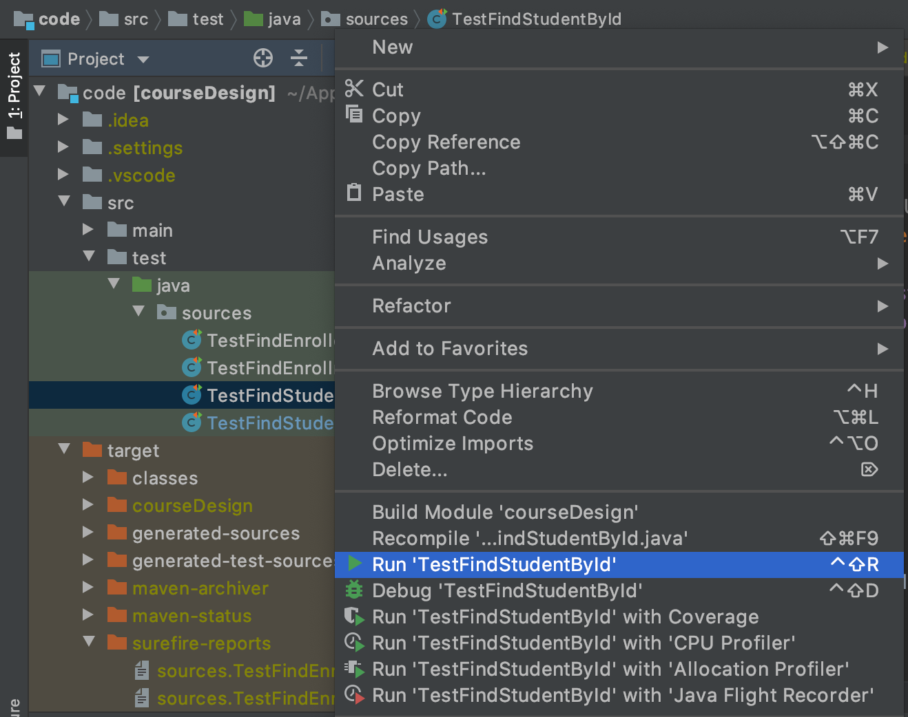
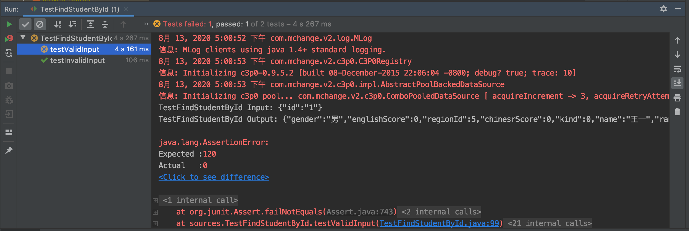

测试脚本说明
===

目录
---

[TOC]

## 1. 测试所有接口

1. 打开IDEA

2. 点击右边栏的Maven按钮

3. 双击test

命令行中会显示测试情况，一共测了9组输入，其中6组测试不通过，1组报错，2组测试通过。

4. 查看测试报告

在`code/target/surefire-reports`路径下查看各个接口的测试报告，如`sources.TestFindStudentById.txt`。

测试不通过的原因为某个值的期望值为120，实际输出为0。

5. 查看测试代码

在`code/src/test/java/sources`路径中可以看到测试代码，学生的语文成绩期望值为120，实际输出为0。

## 2. 测试单个接口

1. 运行测试方法

在`code/src/test/java/sources`路径中可以看到测试代码，选中某一个，然后右键选择运行。

2. 查看测试结果

在命令行中查看测试结果，testValidInput方法测试失败，testInvalidInput方法测试成功。

## 3. 注意事项

如果接口新增或减少了对`request`和`response`对象的操作，则测试脚本需要更新，否则测试无法通过。

若在修改过程中存在此类操作，请联系测试脚本编写者更新脚本。
