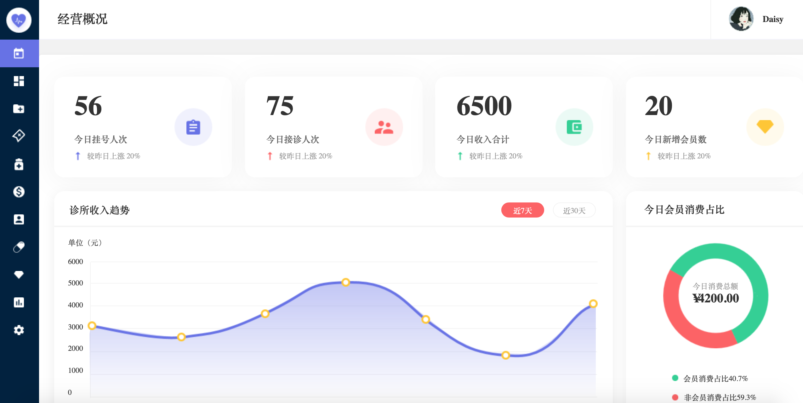
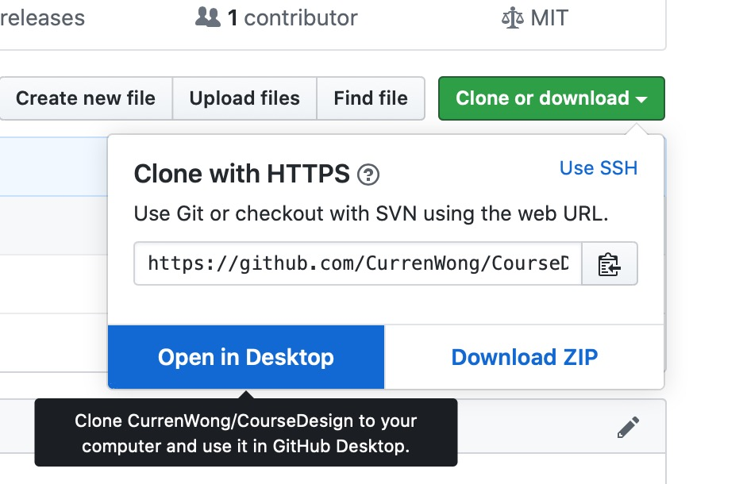

软件协同设计小组分工
====

## 1. 角色分工

### 1.1. 小组长 Team leader

- 组建并维持一个有效的小组
    - 制定小组目标，记录目标完成情况
    - 制定项目启动书与项目章程
    - 激励小组成员
    - 解决冲突
- 向老师报告进度
- 召集并有效地组织小组会议

> 负责人：王浩

### 1.2. 客户接口经理 Customer manager

- 关注客户
- 定义用户需求
    - 需求获取、定义
    - 需求文档化
    - 需求验证
    - 定义软件需求规范
- 撰写软件需求规范SRS
- 需求变更管理
    - 记录变更、审核、修改SRS

> 负责人：闫开元

### 1.3. 开发经理 Development manager

- 生产出高质量的产品
    - 发挥开发人员的能力
    - 领导总体设计与详细设计、编码
- 开发工具与软件运行平台
- 高质量的设计文档（总体设计与详细设计）
- 小组所有的风险都有记录并写进每周工作报告中

> 负责人：周航

### 1.4. 计划经理 Planning manager

- 为项目、小组成员制定一个详细的计划
    - 与质量经理一起制定质量计划
    - 小组会上记录每个成员的执行数据
    - 报告计划执行情况，进行风险分析
- 维护完整计划，向团队成员与领导汇报计划执行与调整建议。

> 负责人：王浩

### 1.5. 质量经理 Quality manager

- 制定团队质量计划
- 与测试经理一起制定测试用例
- 质量跟踪：
    - 质量问题分析与预警
- 质量审查：
    - 所有的产品进行了检查
    - 记录审查与修改情况

> 负责人：余文婧

### 1.6. 测试经理 Test manager

- 制定测试计划
    - 制定测试用例
    - 进行集成测试
- 编写测试报告

> 负责人：龚美

## 2. 开发任务分工

### 2.1. 原型设计

1. 根据产品需求，使用Axure RP画出产品原型设计图并设计跳转逻辑，如下图所示

2. 画出用户操作流程图

> 负责人：王浩

### 2.2. 前端开发

1. 根据原型完成前端页面内容的开发
2. 完成页面跳转逻辑（使用JavaScript，前后端分离）
3. 通过调用服务端接口进行交互，获取数据
4. 通过向服务端发送消息，存储数据到数据库中

> 负责人：王浩、周航

### 2.3. 服务端开发

1. 通过SQL与数据库交互，获取数据
2. 开发数据接口，供前端调用

> 负责人：闫开元、余文婧、龚美

### 2.4. 数据库开发

1. 根据产品需求和产品原型，设计数据表
2. 填充样例数据
3. 编写数据字典（数据字段说明）

> 负责人：余文婧

### 2.5. 软件测试

1. 设计测试用例
2. 完成集成测试

> 负责人：龚美

## 3. 开发工具

### 3.1. 代码管理工具 - Github

1. 注册[Github](https://github.com)
2. 进入我创建的项目[https://github.com/CurrenWong/CourseDesign](https://github.com/CurrenWong/CourseDesign)
3. 通过Github Desktop克隆文件到本地

4. 切换到dev分支
5. 每次开始更改文件之前，点击Pull origin，拉取最新文件到本地
6. 每次更改完成以后，输入Summary，点击Commit，保存更改
7. 保存更改后，点击Push origin，将更改推送到远程分支

### 3.2. 包管理工具 - Maven

### 3.3. 文档管理工具 - 石墨文档
